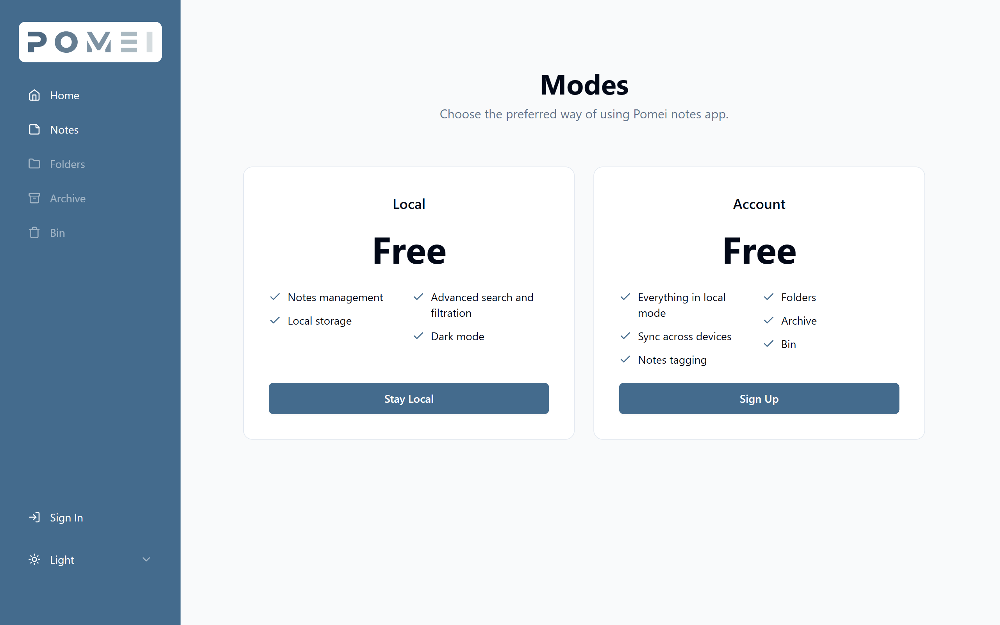
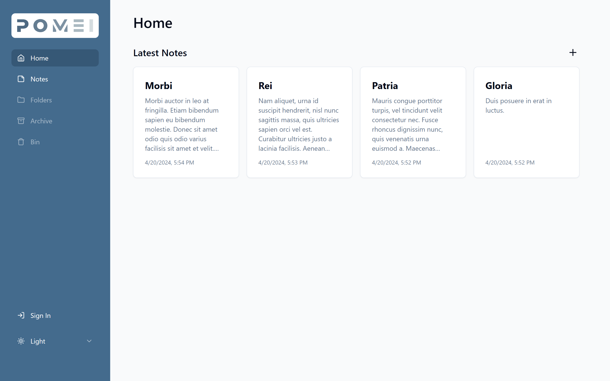
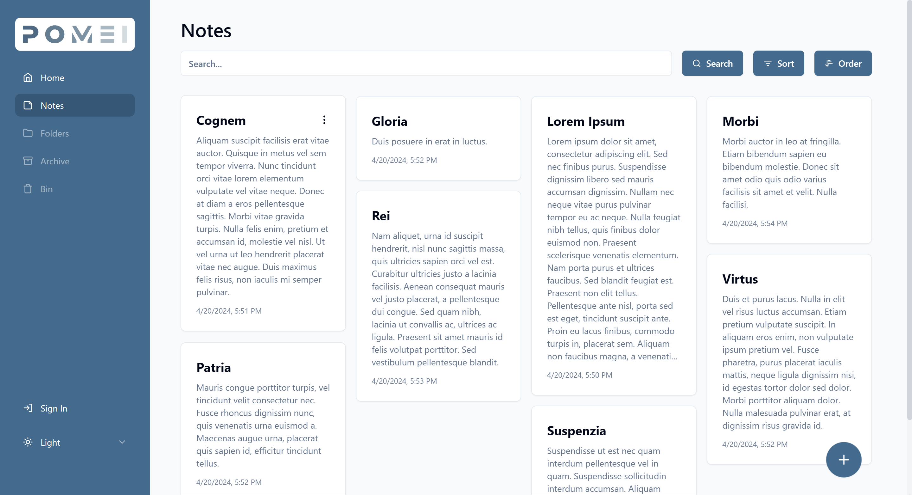
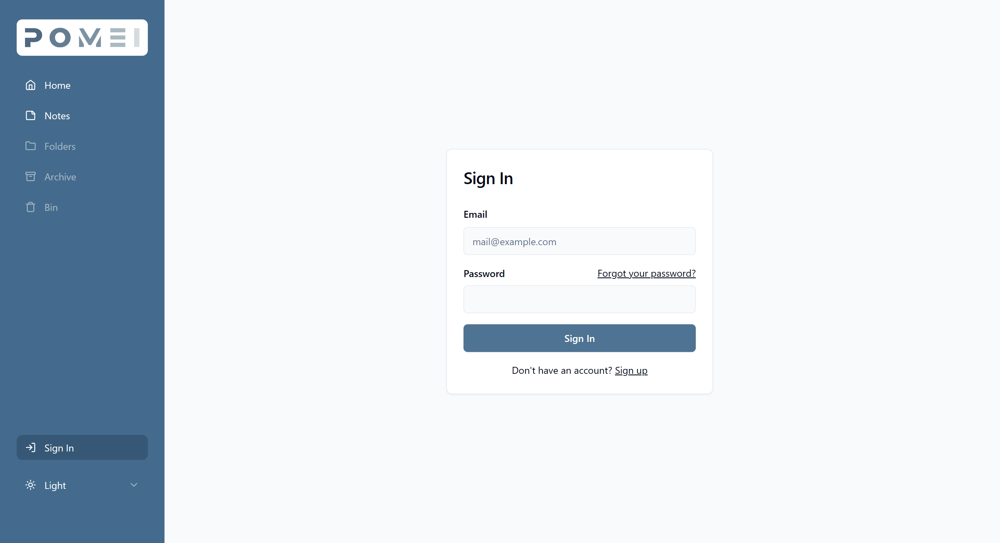
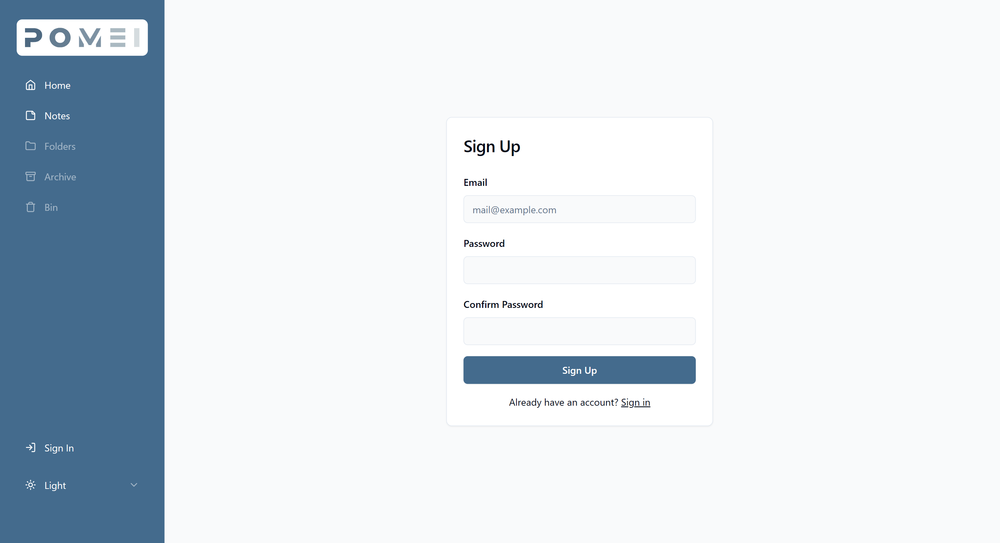
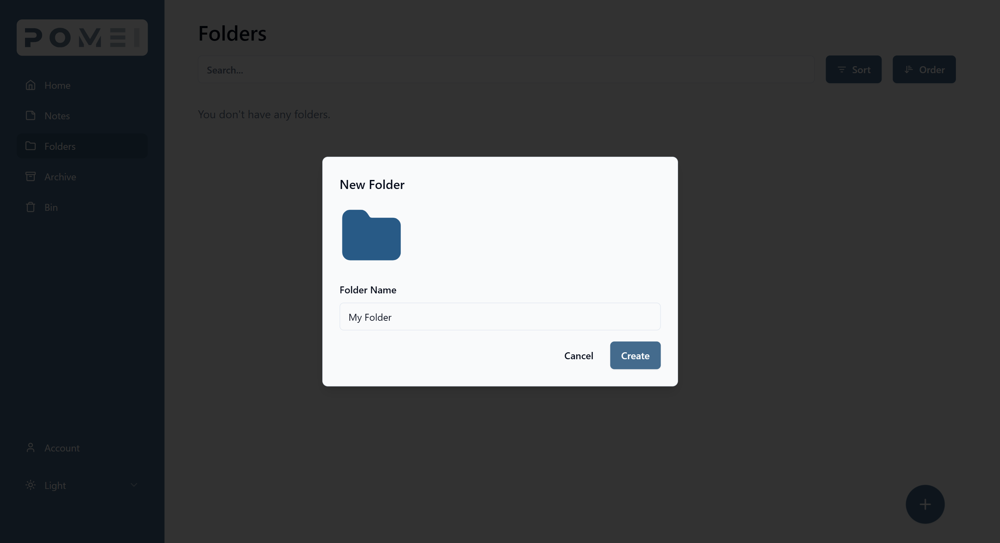
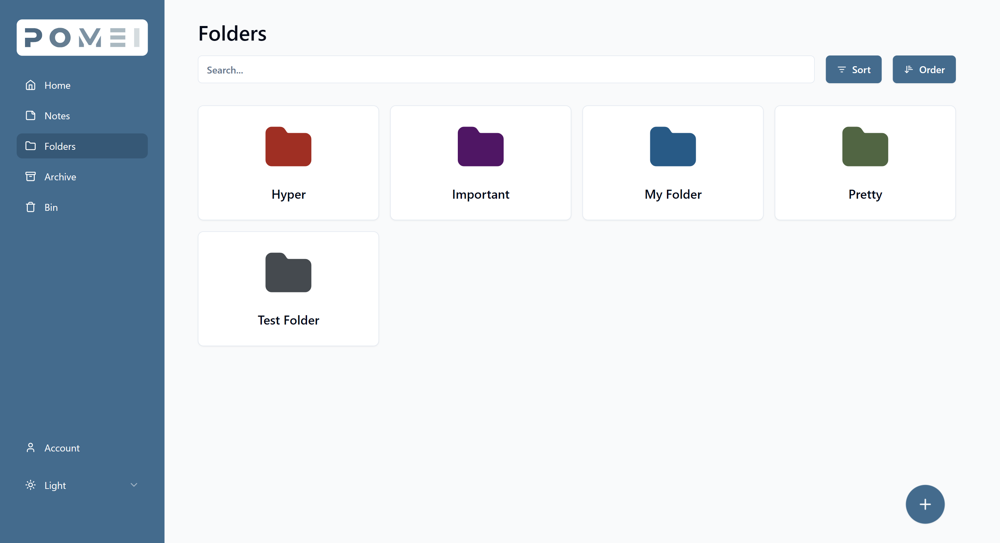
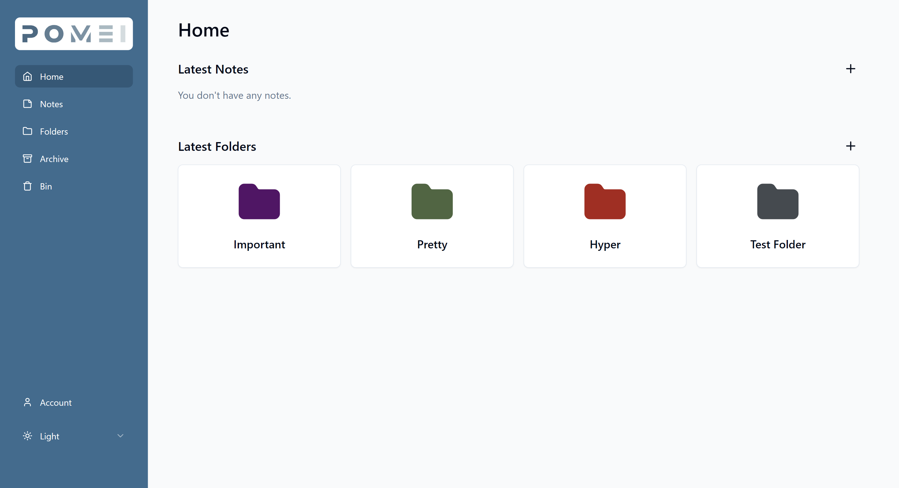
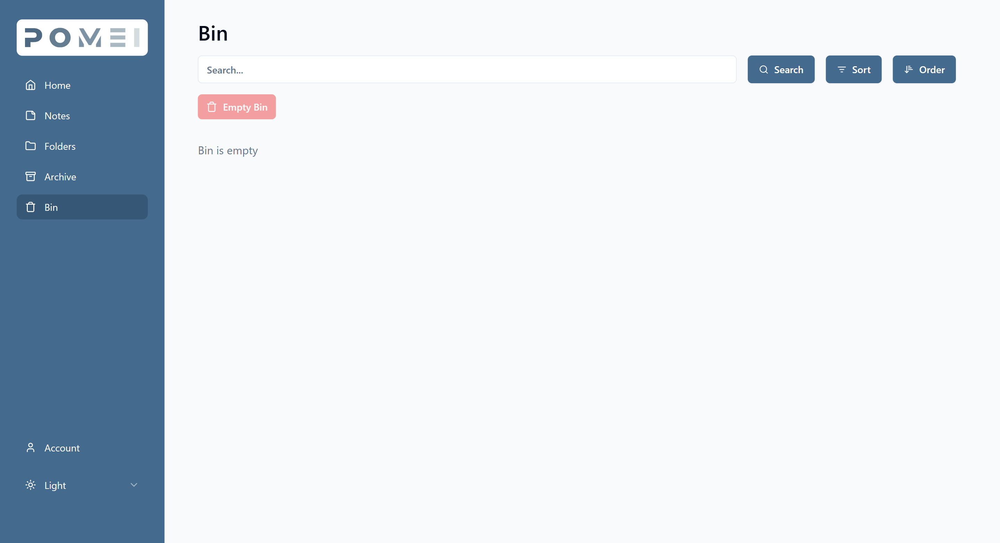
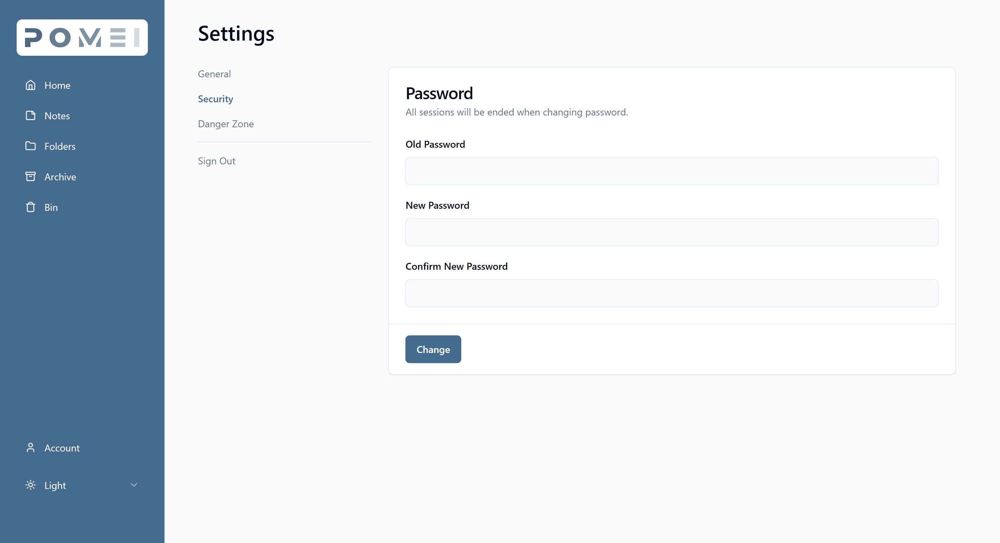

<!-- PROJECT LOGO -->
 

  

  <h3 align="center">Pomei</h3>

  

    Simple note-taking app.
     
     
    <a href="https://pomei.pages.dev">Live View</a>
    ·
    <a href="https://github.com/Dunkelhaiser/Pomei/issues">Report Bug</a>
    ·
    <a href="https://github.com/Dunkelhaiser/Pomei/issues">Request Feature</a>
  

  
Table of Contents

  <ol>
    <li>
      <a href="#about-the-project">About The Project</a>
      <ul>
        <li><a href="#built-with">Built With</a></li>
        <li><a href="#hosted-on">Hosted On</a></li>
        <li><a href="#about">Screenshots</a></li>
        <li><a href="#screenshots">Screenshots</a></li>
      </ul>
    </li>
  </ol>

## About The Project

### Built With

- [![Vite][Vitejs]][Vite-url]
- [![React][React.js]][React-url]
- [![TypeScript][TypeScriptlang]][TypeScript-url]
- [![Tailwind][Tailwind]][Tailwind-url]
- [![ShadCN][ShadCN]][ShadCN-url]
- [![ReactQuery][ReactQuery]][ReactQuery-url]
- [![TanstackRouter][TanstackRouter]][TanstackRouter-url]
- [![PNPM][PNPM]][PNPM-url]
- [![Node.js][Node]][Node-url]
- [![Fastify][Fastify]][Fastify-url]
- [![Drizzle][Drizzle]][Drizzle-url]
- [![PostgreSQL][Postgres]][Postgres-url]

### Hosted on

- [![Cloudflare][Cloudflare]][Cloudflare-url]
- [![Render][Render]][Render-url]

To run the project, clone repo run "pnpm i" and "pnpm run dev", or access it at <https://pomei.pages.dev>.

**Due to the project being hosted on Render free tier, there may be 50 seconds of server inactivity on the first visit. If any server error occurs on the first visit, please try again after 50 seconds**

### About

Pomei is a note-taking app, that can be used locally or with a personal account.
In the local version, you can create, view, edit and delete your notes. Notes are saved in local storage. Notes are written in the rich text editor with support of font formatting, headings, and lists. Notes can be searched for by title or content and be sorted by title, creation or editing date.
When you have an account you gain access to folders, where notes can be stored. Each folder can have its name and color and also can be searched for or sorted. Now, notes also can have tags by which they can be searched for. Notes can be moved to the archive. Additionally, instead of permanently deleting notes, you can move them to the bin, where they will be stored for 30 days, and then automatically deleted.

### Screenshots

[React.js]: https://img.shields.io/badge/React-20232A?style=for-the-badge&logo=react&logoColor=61DAFB
[React-url]: https://react.dev/
[Tailwind]: https://img.shields.io/badge/tailwindcss-%2338B2AC.svg?style=for-the-badge&logo=tailwind-css&logoColor=white
[Tailwind-url]: https://tailwindcss.com/
[ShadCN]: https://img.shields.io/badge/shadcn%2Fui-000000?style=for-the-badge&logo=shadcnui&logoColor=white
[ShadCN-url]: https://ui.shadcn.com/
[TypeScriptlang]: https://img.shields.io/badge/TypeScript-007ACC?style=for-the-badge&logo=typescript&logoColor=white
[TypeScript-url]: https://www.typescriptlang.org/
[Vitejs]: https://img.shields.io/badge/vite-%23646CFF.svg?style=for-the-badge&logo=vite&logoColor=white
[Vite-url]: https://vitejs.dev/
[ReactQuery]: https://img.shields.io/badge/React_Query-FF4154?style=for-the-badge&logo=ReactQuery&logoColor=white
[ReactQuery-url]: https://tanstack.com/query/latest
[TanstackRouter]: https://img.shields.io/badge/react%20router-10b981?style=for-the-badge&logo=react%20table&logoColor=white
[TanstackRouter-url]: https://tanstack.com/router/latest
[Node]: https://img.shields.io/badge/node.js-6DA55F?style=for-the-badge&logo=node.js&logoColor=white
[Node-url]: https://nodejs.org/
[Fastify]:https://img.shields.io/badge/fastify-%23000000.svg?style=for-the-badge&logo=fastify&logoColor=white
[Fastify-url]: https://fastify.dev/
[Postgres]: https://img.shields.io/badge/postgres-%23316192.svg?style=for-the-badge&logo=postgresql&logoColor=white
[Postgres-url]: https://www.postgresql.org/
[Drizzle]: https://img.shields.io/badge/drizzle-C5F74F?style=for-the-badge&logo=drizzle&logoColor=black
[Drizzle-url]: https://orm.drizzle.team/
[PNPM]: https://img.shields.io/badge/pnpm-yellow?style=for-the-badge&logo=pnpm&logoColor=white
[PNPM-url]: https://pnpm.io/

[Cloudflare]: https://img.shields.io/badge/Cloudflare%20Pages-F38020?style=for-the-badge&logo=Cloudflare%20Pages&logoColor=white
[Cloudflare-url]: https://pages.cloudflare.com/
[Render]: https://img.shields.io/badge/Render-46E3B7?style=for-the-badge&logo=render&logoColor=white
[Render-url]: https://render.com/
